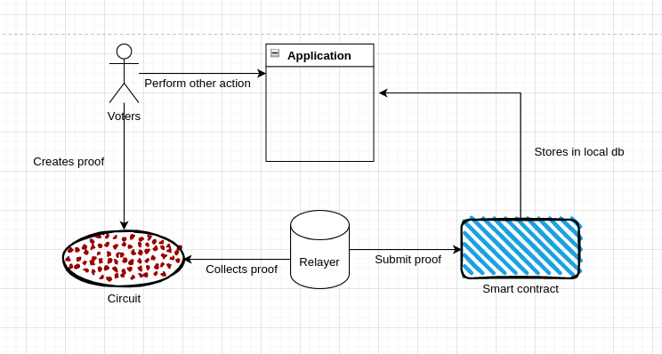

# SPIC 

SPIC (Semaphore Protected Incentivized Community)

## Introduction:
Intro about the original project and what USP this project will have after the zk effect put in

This project has extended the idea of Coordinape. Coordinape is a DAO tool that is used to reward community incentives, grants, and payroll through community derived voting process. 

The way coordinape works is an intersection between how corporate organizations handle these sorts of tasks and how a purely decentralized flat hierarchy based system will handle it. 

Coordinape works the following way:
- You have an organization owner
- You have a coordinator who creates a circle and adds people in that circle by there public address
- These members are allocated with GIVE tokens (which are offchain tokens)
- Each member of circle can allocate or vote these GIVE tokens to another person of the circle
- By the end of EPOCH, GIVE tokens are converted into GET tokens which can be redeemed by the user in place of USDC

This is the basic overview of how coordinape works. 

But what if we introduce the notion of semaphore framework in order to hide the identities of the voters while voting, while maintaining the transparency of the process of the allocation of GIVE tokens through votes. 

## Project Overview:
Users can create semaphore identity, the zk part includes the protection of identity of users while voting. Identity commitment can reveal public key of the users, but that is not what we are protecting.

### Actors:
Following are the actors of the system who’ll be performing the actions in the system. Each actor’s scope of access is different and not all actor’s identities are protected through semaphore. 

**Admin**:
Actor is responsible for the following actions:
- Creating organization
- Creating circles
- Adding contributors for whom people can vote for
    -This is same as it is done in coordinape. People can vouch in for people in the discord channel. And from there admin can collect the data and add contributors to the project
-Adding funds to the contract in order to execute the payment. Let’s say you have 100 DAI in your fund for that circle. Now if one voter is joining that circle so the vote weight will be 100 DAI (Total fund / no of voters = Per voter token allocation to vote)
- Specifying the epoch time
- Starting the epoch
- Specifying the voter’s incentivization allocation in the token pool

*ADMIN can be a multisig contract as well.
*ADMIN won’t have to start the epoch in future version of this application 

**Contributor**:
Role of the contributor is as follows:
- Contributors will be added by admin in the circle before the start of epoch
- Contributors will be receiving votes 
- By the end of epoch, contributors can claim those votes on the blockchain and earn DAI or any token 

**Voter**:
User journey of the voter is the main part of the whole application. The journey is as follow:
- Voters must NFT of the community to become voter
- Anyone who holds the NFT can become a voter
- The way anyone can become the voter is as follows:
    - Voter first need to select to which circle he’ll be voting in
    - Identity of the voters will be made using semaphore. 
    - Identity commitment will be made. Details will be discussed in the Design part of the document
- Voters can vote to the contributors by making external nullifier of that contributor and circle
- Upon the finishing of epoch, voter can provide the proof that he has actually voted and his identity existed in the semaphore, he then can claim the NFT back + some incentive token to participate in the voting mechanism

### Design:
Before diving deep into the technical architecture let’s first discuss the public & private parameters of the circuit while building identity commitment and external nullifier for vote.

**Circuit**:
The purpose of the circuits is:
1. To verify the semaphore identity of the user
2. To verify the external nullifer of the vote by proving its existence in the merkle tree
3. To verify both point 1 and 2 while withdrawing NFT and reward tokens

*identity_nullifier.circom*:
- Private parameters
    - Identity nullifier
    - Identity trapdoor
    - Secret 
    - Merkle path
    - Path indices
- Public parameters
    - NFT id
    - NFT contract address
    - Public key of the users
    - Merkle root

*voting_nullifier.circom* :
- Private parameters:
    - Identity nullifier 
    - Merkle path
    - Path indices
- Public parameters:
    - Identity commitment
    - Voting nullifier (hash = (circle id , contributor’s pk)
    - Merkle root

**Contract** :
The purpose of the contract is:
- To create organization in which circles can be added and contributors can be added
- Functionality to submit the voting commitment 
- Handling the voting weight as per the allocated match fund
- To behave as an escrow where people can deposit NFT 
- To make sure voting starts and ends at the right epoch time and ensure the security as well

Some contracts:
1. Semaphore (existing contracts will be used after making some additional changes)
2. Token (Mock ERC20 token)
3. NFT (Mock ERC721 token)
4. Verifier contract (groth16 verifier contract)

### System Design:

**Relayer**:
To send private transactions to the smart contract of voting, and claiming NFT by the voters. Relayers are not decentralized yet, but in future much better design can be implemented to reduce the dependency to execute private transactions. 

**Smart contract**:
As described in above section.

**Indexing**:
For indexing, in the MVP version local storage of the browser will be used to store the state of users and voters. In the extended version, a subgraph can be deployed to listen to the events emitted by the smart contract.

**Circuits**:
As described in above section.

## Out of Scope:
- Resolving off-chain collusion issues
- Resolving the selection of members through vouching process on discord
- There’s a limitation right now on how many members can vote, in future it has to be generalized

## How to Run:
//TODO

